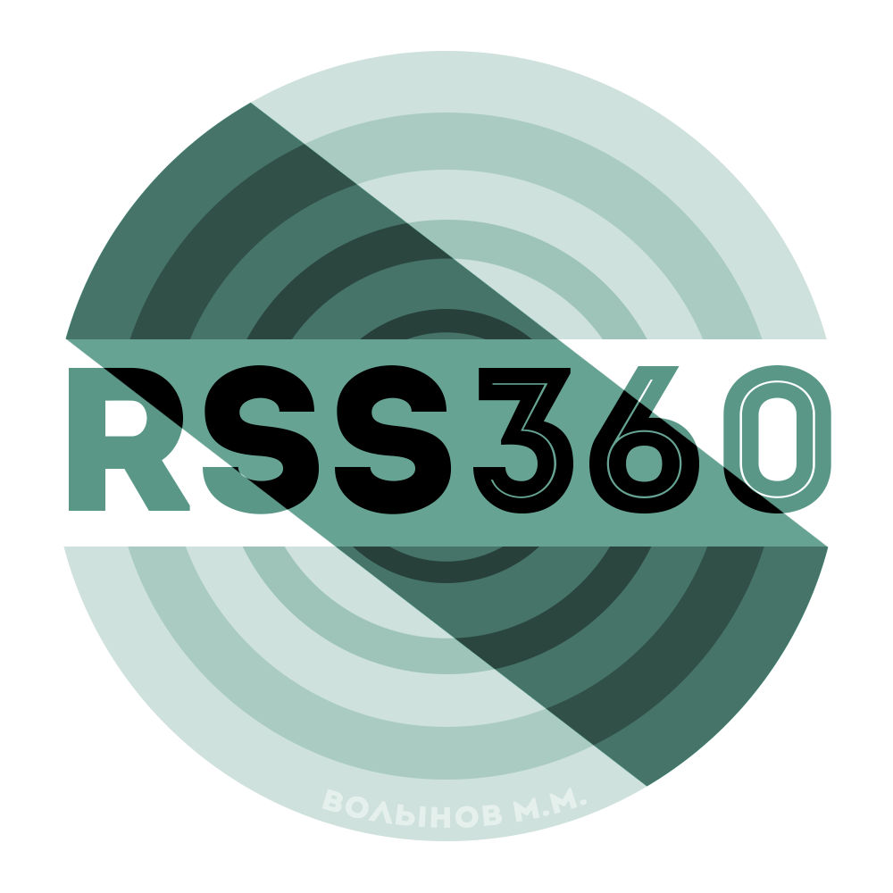

    

# RSS 360
#### RSS Radar that you were looking for.

### Introduction
**RSS 360** is simple and mighty tool that allows you to scan
a bunch of websites and fetch links of RSS channels from it.

### Installation
Basic requirements: Python 3.6 or higher.

All actions must be performed in the project directory.

##### Linux platform
1. Installing and activating virtualenv (not necessary but recommended

        pip3 install virtualenv

        virtualenv env --python=python3.6

        source env/bin/activate/

2. Installing requirements

        pip install -r requirements.txt

        python core.py

 And you're good to go.
